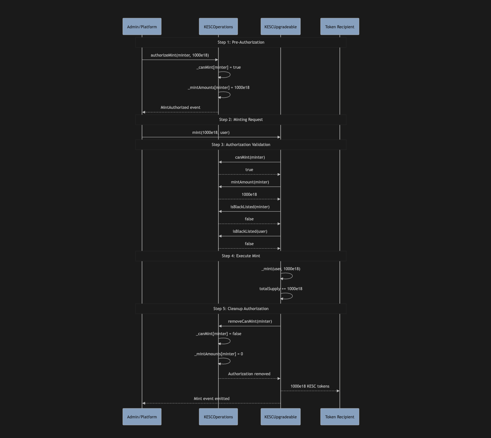

# KESC Stablecoin - Kenyan Shilling Coin

KESC is an ERC-20 stablecoin pegged 1:1 to the Kenyan Shilling (KES), designed for deployment on Ethereum Layer 2 networks including Base and Scroll.

## Features

- **ERC-20 Compliant**: Standard token implementation with 18 decimals
- **1:1 KES Peg**: Each KESC token is backed by 1 Kenyan Shilling held in reserves
- **Role-Based Access Control**: Secure minting and administrative functions
- **Pausable**: Emergency stop functionality for security
- **Burnable**: Token redemption for fiat currency
- **Multi-Network**: Deployable on Base and Scroll L2 networks
- **Upgradeable**: Proxy pattern for future enhancements
- **Blacklisting**: Compliance-friendly address blacklisting
- **Whitelisting**: Advanced transfer controls for on/off-ramp scenarios
- **Meta-Transactions**: Support for gasless transactions via trusted forwarders
- **Reentrancy Protection**: Protection against reentrancy attacks
- **Advanced Mint Authorization**: Granular control over minting operations

## Token Details

- **Name**: Kenyan Shilling Coin
- **Symbol**: KESC
- **Decimals**: 18
- **Standard**: ERC-20

## Roles

- **DEFAULT_ADMIN_ROLE**: Can grant/revoke other roles
- **MINTER_ROLE**: Can mint new tokens (backing must be provided off-chain)
- **PAUSER_ROLE**: Can pause/unpause token transfers

## Contract Versions

### KESC (Simple Version)
- Non-upgradeable implementation
- Basic role-based access control
- Standard ERC-20 functionality with minting/burning

### KESCUpgradeable (Enhanced Version)
- Upgradeable proxy pattern
- Advanced blacklisting and whitelisting
- Meta-transaction support
- Reentrancy protection
- Modular admin operations

## Smart Contract Functions

### Core ERC-20 Functions (Both Versions)
- `transfer(address to, uint256 amount)`: Transfer tokens
- `transferFrom(address from, address to, uint256 amount)`: Transfer tokens on behalf
- `approve(address spender, uint256 amount)`: Approve spending
- `balanceOf(address account)`: Get token balance
- `totalSupply()`: Get total token supply

### Minting Functions
**Simple Version:**
- `mint(address to, uint256 amount)`: Mint tokens (MINTER_ROLE required)
- `mint(address to, uint256 amount, string reason)`: Mint tokens with reason

**Upgradeable Version:**
- `mint(uint256 amount, address mintTo)`: Mint tokens with authorization (MINTER_ROLE required)
- `mintWithReason(uint256 amount, address mintTo, string reason)`: Mint tokens with reason

### Burning Functions
**Simple Version:**
- `burn(uint256 amount)`: Burn tokens from caller's balance
- `burn(uint256 amount, string reason)`: Burn tokens with reason
- `burnFrom(address from, uint256 amount, string reason)`: Burn tokens from specified address (MINTER_ROLE required)

**Upgradeable Version:**
- `burnWithReason(uint256 amount, string reason)`: Burn tokens with reason
- `burnFromWithReason(address from, uint256 amount, string reason)`: Burn tokens from specified address (MINTER_ROLE required)

### Administrative Functions (Both Versions)
- `pause()`: Pause all token transfers (PAUSER_ROLE required)
- `unpause()`: Resume token transfers (PAUSER_ROLE required)
- `grantMinterRole(address account)`: Grant minting privileges
- `revokeMinterRole(address account)`: Revoke minting privileges
- `grantPauserRole(address account)`: Grant pausing privileges
- `revokePauserRole(address account)`: Revoke pausing privileges

### Enhanced Functions (Upgradeable Version Only)
- `destroyBlackFunds(address blacklistedUser)`: Destroy tokens from blacklisted address
- `updateTrustedForwarder(address newForwarder)`: Update meta-transaction forwarder
- `updateAdminOperations(address newAdminContract)`: Update admin operations contract
- `grantBlacklistManagerRole(address account)`: Grant blacklist management privileges
- `revokeBlacklistManagerRole(address account)`: Revoke blacklist management privileges

### KESCOperations Contract Functions
- `addToBlackList(address account)`: Add address to blacklist
- `removeFromBlackList(address account)`: Remove address from blacklist
- `addToInternalWhitelist(address account)`: Add address to internal whitelist
- `addToExternalWhitelist(address account)`: Add address to external whitelist
- `authorizeMint(address minter, uint256 amount)`: Authorize specific mint amount
- `removeCanMint(address minter)`: Remove mint authorization

### Utility Functions (Both Versions)
- `balanceOfFormatted(address account)`: Get balance in human-readable format (divided by 10^18)
- `totalSupplyFormatted()`: Get total supply in human-readable format

## Operational Workflows

### Minting Process Workflows

#### Two-Step Authorization Process (Upgradeable Version)

The upgradeable KESC contract implements a secure two-step minting process that ensures proper authorization and maintains the 1:1 KES backing:

 

#### OneRamp On-Ramp Integration

This diagram shows how KESC minting integrates with OneRamp's KES deposit process:


### Burning Process Workflows

#### 1. User-Initiated Redemption


#### 2. Platform-Managed Redemption


#### 3. Automatic Off-Ramp (Upgradeable Version)


#### 4. Compliance Burn (Blacklisted Addresses)


### Key Workflow Benefits

#### Security Features
- **Two-step authorization**: Prevents unauthorized minting
- **Single-use authorization**: Prevents replay attacks
- **Role-based access**: Granular permission control
- **Blacklist compliance**: Regulatory requirement support

#### Operational Efficiency
- **Automatic authorization cleanup**: Prevents accumulation of stale permissions
- **Batch operations**: Cost-effective bulk operations
- **Meta-transaction support**: Gasless user experience
- **Automatic off-ramp burning**: Seamless user experience

#### 1:1 Peg Maintenance
- **Controlled minting**: Only with proper KES backing
- **Immediate burning**: Maintains supply-reserve ratio
- **Audit trail**: Complete transaction history
- **Reserve tracking**: Total supply reflects backing requirements

## Setup

### Prerequisites
- [Foundry](https://book.getfoundry.sh/getting-started/installation)
- Node.js and npm (optional, for additional tooling)

### Installation

1. Clone the repository
```bash
git clone <repository-url>
cd stable
```

2. Install dependencies
```bash
forge install
```

3. Copy environment file
```bash
cp env.example .env
```

4. Configure your environment variables in `.env`:
   - `PRIVATE_KEY`: Your deployment private key (without 0x prefix)
   - RPC URLs for your target networks
   - Etherscan API keys for contract verification

## Usage

### Build

```shell
forge build
```

### Test

```shell
forge test
```

### Test with Verbosity

```shell
forge test -vv
```

### Deploy Simple Version (KESC)

#### Local Network
1. Start local node:
```shell
anvil
```

2. Deploy contract:
```shell
forge script script/DeployKESC.s.sol:DeployKESC --fork-url http://localhost:8545 --private-key <your_private_key> --broadcast
```

#### Base Sepolia (Testnet)
```shell
forge script script/DeployKESC.s.sol:DeployKESC --rpc-url base-sepolia --private-key $PRIVATE_KEY --broadcast --verify
```

#### Base Mainnet
```shell
forge script script/DeployKESC.s.sol:DeployKESC --rpc-url base --private-key $PRIVATE_KEY --broadcast --verify
```

#### Scroll Networks
```shell
# Scroll Sepolia (Testnet)
forge script script/DeployKESC.s.sol:DeployKESC --rpc-url scroll-sepolia --private-key $PRIVATE_KEY --broadcast --verify

# Scroll Mainnet
forge script script/DeployKESC.s.sol:DeployKESC --rpc-url scroll --private-key $PRIVATE_KEY --broadcast --verify
```

### Deploy Upgradeable Version (KESCUpgradeable) - **Recommended**

#### Local Network
1. Start local node:
```shell
anvil
```

2. Deploy upgradeable contracts:
```shell
forge script script/DeployKESCUpgradeable.s.sol:DeployKESCUpgradeable --fork-url http://localhost:8545 --private-key <your_private_key> --broadcast
```

#### Base Sepolia (Testnet)
```shell
forge script script/DeployKESCUpgradeable.s.sol:DeployKESCUpgradeable --rpc-url base-sepolia --private-key $PRIVATE_KEY --broadcast --verify
```

#### Base Mainnet
```shell
forge script script/DeployKESCUpgradeable.s.sol:DeployKESCUpgradeable --rpc-url base --private-key $PRIVATE_KEY --broadcast --verify
```

#### Scroll Networks
```shell
# Scroll Sepolia (Testnet)
forge script script/DeployKESCUpgradeable.s.sol:DeployKESCUpgradeable --rpc-url scroll-sepolia --private-key $PRIVATE_KEY --broadcast --verify

# Scroll Mainnet
forge script script/DeployKESCUpgradeable.s.sol:DeployKESCUpgradeable --rpc-url scroll --private-key $PRIVATE_KEY --broadcast --verify
```

## Interacting with the Contract

After deployment, you can interact with the contract using `cast`:

### Check Token Details
```bash
cast call <contract_address> "name()" --rpc-url <rpc_url>
cast call <contract_address> "symbol()" --rpc-url <rpc_url>
cast call <contract_address> "decimals()" --rpc-url <rpc_url>
```

### Check Balances
```bash
cast call <contract_address> "balanceOf(address)(uint256)" <address> --rpc-url <rpc_url>
cast call <contract_address> "totalSupply()(uint256)" --rpc-url <rpc_url>
```

### Mint Tokens (requires MINTER_ROLE)
```bash
cast send <contract_address> "mint(address,uint256)" <recipient_address> <amount_in_wei> --private-key $PRIVATE_KEY --rpc-url <rpc_url>
```

### Transfer Tokens
```bash
cast send <contract_address> "transfer(address,uint256)" <recipient_address> <amount_in_wei> --private-key $PRIVATE_KEY --rpc-url <rpc_url>
```

## Security Considerations

1. **Access Control**: Only grant MINTER_ROLE to trusted addresses
2. **Reserve Backing**: Ensure 1:1 backing with KES reserves before minting
3. **Multi-sig**: Consider using multi-signature wallets for admin roles
4. **Pause Mechanism**: Use pause functionality in case of emergencies
5. **Audit**: Conduct thorough security audits before mainnet deployment

## Post-Deployment Configuration (Upgradeable Version)

After deploying the upgradeable version, you'll need to configure the system:

### 1. Set up Whitelists and Blacklists
```bash
# Add OneRamp platform to internal whitelist (for receiving tokens during off-ramp)
cast send <operations_address> "addToInternalWhitelist(address)" <oneramp_platform_address> --private-key $PRIVATE_KEY --rpc-url <rpc_url>

# Add users to external whitelist (for sending tokens to platform during off-ramp)
cast send <operations_address> "addToExternalWhitelist(address)" <user_address> --private-key $PRIVATE_KEY --rpc-url <rpc_url>
```

### 2. Authorize Minting
```bash
# Authorize a specific mint amount for a minter
cast send <operations_address> "authorizeMint(address,uint256)" <minter_address> <amount_in_wei> --private-key $ADMIN_PRIVATE_KEY --rpc-url <rpc_url>

# Mint tokens (can only be done after authorization)
cast send <token_address> "mint(uint256,address)" <amount_in_wei> <recipient_address> --private-key $MINTER_PRIVATE_KEY --rpc-url <rpc_url>
```

### 3. Manage Roles
```bash
# Grant roles to operational addresses
cast send <token_address> "grantMinterRole(address)" <minter_address> --private-key $ADMIN_PRIVATE_KEY --rpc-url <rpc_url>
cast send <operations_address> "grantMintManagerRole(address)" <mint_manager_address> --private-key $ADMIN_PRIVATE_KEY --rpc-url <rpc_url>
```

### 4. Set Trusted Forwarder (for Meta-Transactions)
```bash
cast send <token_address> "updateTrustedForwarder(address)" <forwarder_address> --private-key $ADMIN_PRIVATE_KEY --rpc-url <rpc_url>
```

## Integration with OneRamp

The KESC token is designed to integrate with the OneRamp platform for:

### On-ramp Flow
1. User sends KES via M-Pesa to custodian
2. Custodian confirms receipt of fiat
3. Platform authorizes mint for specific amount
4. Platform mints KESC to user's wallet
5. Mint authorization is automatically revoked

### Off-ramp Flow  
1. User sends KESC to OneRamp platform address (whitelisted)
2. If user is on external whitelist, tokens are automatically burned
3. Platform processes KES payout via M-Pesa
4. User receives KES in their mobile money account

### Special Transfer Cases
The upgradeable version supports automatic burning for off-ramp scenarios:
- When external whitelist user sends to internal whitelist address
- Tokens are transferred then immediately burned
- This reduces total supply and maintains the peg

## License

MIT License - see LICENSE file for details.

## Support

For technical support and questions, please contact the OneRamp development team.
